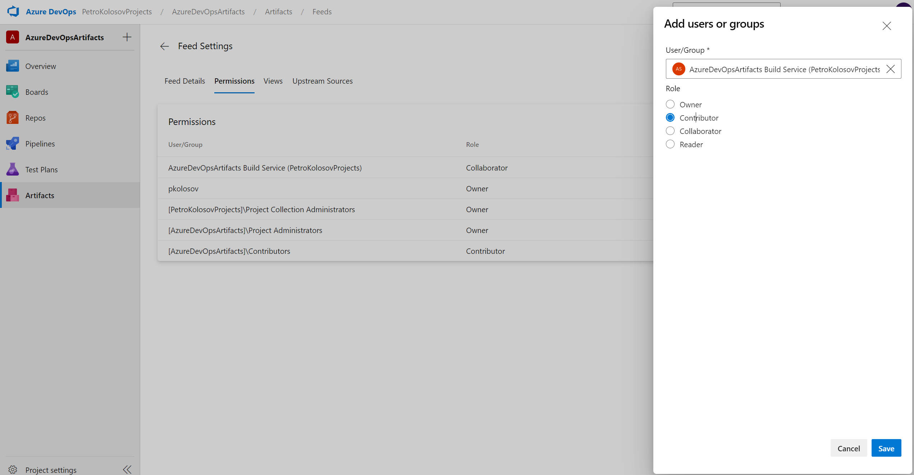

# Azure DevOps Artifacts

Create, pack and publish nuget package to azure devops artifacts feed for further consumption.

## Steps

- Create feed
- Restore packages in solution
- Add feed to `nuget.config`
- Download latest `nuget.exe`: [Download nuget](https://www.nuget.org/downloads)
- Add `nuget.exe` to PATH
- To clear local nuget cache: `nuget locals -clear all`
- Restore packages: `nuget restore` -- it will upload all you packages to the azure
  devops feed so that you can consume them in your projects, it is strange
- Clear default nuget feed, now you can restore from your devops feed

## Nuget feed service connection

- Generate PAT with permissions: `package:read`, `package:write`, `package:manage`
- Add service connection

## IF YOU HAVE 403 ERROR ON NUGET PUSH (!!!)

- https://stackoverflow.com/a/65753394
